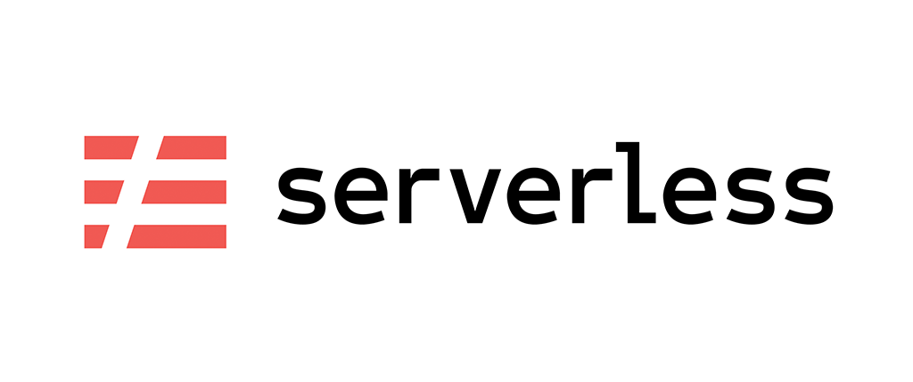

# sls-base



Base for create a project in serverless framework

## What's included

- Folder structure used consistently across our projects.
- [serverless-pseudo-parameters plugin](https://www.npmjs.com/package/serverless-pseudo-parameters): Allows you to take advantage of CloudFormation Pseudo Parameters.
- [serverless-plugin-optimize](https://www.npmjs.com/package/serverless-plugin-optimize): Bundle with Browserify, transpile and minify with Babel automatically to your NodeJS runtime compatible JavaScript.

## Getting started

```shell
sls create --name YOUR_PROJECT_NAME --template-url https://github.com/ivanojgarcia/sls-base
cd YOUR_PROJECT_NAME
npm install
```

## Execute the serverless local CLI

To avoid issues by version, the serverless package was installed locally.
For that, the Serverless Framework CLI as Dev Dependency.
You can use the serverless commands using `npm run sls [-- <args>]`, where the `--` delimits options for the `npm run` command and you must pass the arguments to the `sls` script.

Examples:

```shell

  npm run sls -- deploy -s dev
  npm run sls -- offline -s dev

```

## Update the dependence

To update the dependence yo must run the command `npm run npm-check` for check the update, after that execute the command to update the dependecies `npm run npm-check -- -u`
the reference [here](https://www.npmjs.com/package/npm-check)
